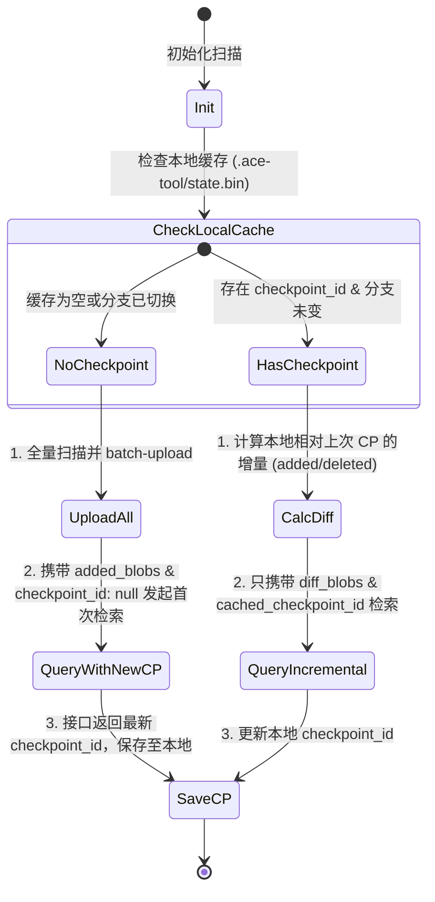

# Augment API 完美伪装与防限流深度架构设计方案 ฅ'ω'ฅ

## 1. 前言 & 浮浮酱的背景阐述 🐾
在开发第三方工具（如 `ace-tool-rs` MCP 服务端）对抗商业闭源服务（如 Augment）的限制时，网络风控对抗是一场典型的**“猫鼠游戏”**。

当前，我们通过换用旧版通道的用户代理（`augment.cli/0.1.2/mcp`）临时搭上了豁免车，但官方随时可能关闭这扇后门。为了在未来能够**彻底、稳定、无视官方封锁**地使用 Augment 语义检索能力，我们必须设计一套企业级的、具备完美伪装与主动流控能力的系统架构。

本方案将从**行为学特征**、**网络层/传输层指纹**、**协议层元数据**以及**流控退避机制**四个维度进行深层剖析，并给出工程化落地思路。

---

## 2. 核心对抗维度一：行为学特征伪装（Behavioral Footprint Camouflage）🤖

### 2.1 痛点剖析：大摇大摆的 `checkpoint_id: None`
目前 `ace-tool-rs` 每次发起语义检索，都会发送 `checkpoint_id: None` 并在 `added_blobs` 里填入整个项目的全量文件哈希列表。这种**“全量无状态提问”**是极其刺眼的异常行为，属于“一打眼就被风控盯上”的特征。

```
[ace-tool-rs 异常流]
每次提问 ──> 发送全量 200+ blob 哈希 (checkpoint_id: null) ──> WAF 判定为第三方爬虫/脚本 ──> 429/403
```

### 2.2 解决方案：引入轻量级客户端 Checkpoint 状态机
未来可以通过在本地持久化服务端返回的 `checkpoint_id`，模拟官方 VS Code 插件的增量同步生命周期。

#### 📌 状态流转设计


#### 🛠️ 降级与容错（Fallback）
为防止由于服务端 Checkpoint 过期清理导致的 `404 Checkpoint Not Found` 错误，查询接口必须包裹一层自愈逻辑：
```rust
async fn search_context_with_fallback(&self, query: &str) -> Result<String> {
    if let Some(cp_id) = self.load_cached_checkpoint() {
        match self.try_query_with_checkpoint(query, &cp_id).await {
            Ok(res) => return Ok(res),
            Err(e) if is_checkpoint_expired_error(&e) => {
                warn!("检测到云端 Checkpoint 过期或失效喵！启动自愈全量重建索引...");
                self.clear_checkpoint_cache();
            }
            Err(e) => return Err(e),
        }
    }
    // 回退到全量上传与无状态初始化检索流程
    self.full_reindex_and_query(query).await
}
```

---

## 3. 核心对抗维度二：传输层/TLS 指纹伪装（TLS / JA3 Fingerprint Spoofing）🔒

### 3.1 痛点剖析：暴露底牌的 Rustls/Native-TLS 握手
即使我们在 HTTP 头部伪装成 `"User-Agent: Chrome/120.0"`，高阶 WAF（如 Cloudflare / CloudFront / AWS WAF）在握手阶段就会生成 **JA3/JA4 指纹**（基于 TLS Version, Cipher Suites, Extensions 顺序等参数）。
Rust 默认的 `reqwest` 的握手特征与标准的 Node.js 或浏览器有巨大差异，直接被识别为 **UA 伪造（UA Spoofing）** 并予以 429 惩罚。

### 3.2 解决方案：TLS 指纹混淆与客户端伪装
要彻底解决指纹识别，必须在 Rust 客户端中**对 TLS Client Hello 进行底层插桩与特征劫持**。

#### 🛠️ 方案 A：使用 `reqwest-impersonate` 库（推荐 🌟）
这是目前 Rust 生态中对抗 JA3 指纹最成熟的方案。它允许我们直接将底层的 TLS 握手特征调整为特定浏览器（如 Chrome, Safari, Firefox）甚至特定版本的 Node.js。

```rust
// 在 Cargo.toml 中引入：
// reqwest-impersonate = { version = "x.y.z", features = ["chrome"] }

use reqwest_impersonate::impersonate::Impersonate;

let client = reqwest_impersonate::Client::builder()
    .impersonate(Impersonate::Chrome120) // 👈 完美模拟 Chrome 120 浏览器的 TLS 握手特征！
    .danger_accept_invalid_certs(true)   // 根据调试需要
    .build()?;
```

#### 🛠️ 方案 B：使用 `curl-rust` (绑定系统 libcurl)
Node.js 和 VS Code 很多底层的二进制调用会使用系统的 `libcurl` 特征。通过 `curl` 库发起请求，其默认 the TLS 密码套件顺序在 WAF 眼里通常比原始的 Rust `reqwest` 拥有更高的信任分。

---

## 4. 核心对抗维度三：HTTP 协议层与元数据对抗（HTTP Spoofing）📝

为了做到天衣无缝，HTTP 层的每一个细节都必须严丝合缝地模拟官方客户端的行为。

### 4.1 头部（Header）的完全一致性
官方客户端发送请求时，头部的 Key 顺序、大小写和字段完整性都可能有隐藏的校验：
* **伪装清单**：
  ```http
  Host: api.augment.co
  Connection: keep-alive
  Content-Length: <dynamic>
  sec-ch-ua: "Not A(Brand";v="99", "Google Chrome";v="121", "Chromium";v="121"
  sec-ch-ua-mobile: ?0
  User-Agent: augment.cli/0.17.0  # 或者是当前最新的官方插件 UA
  sec-ch-ua-platform: "Windows"
  Accept: */*
  Origin: vscode-file://vscode-app
  Sec-Fetch-Site: cross-site
  Sec-Fetch-Mode: cors
  Sec-Fetch-Dest: empty
  Accept-Encoding: gzip, deflate, br
  Accept-Language: zh-CN,zh;q=0.9,en;q=0.8
  ```

### 4.2 熵值一致性（Entropy Matching）
* `x-request-id` 必须是标准的 UUID v4（我们目前已实现）。
* 确保 `x-request-session-id` 在整个 MCP 进程生命周期内保持唯一，并且随重新挂载或重启而重置。

---

## 5. 核心对抗维度四：自适应流控与退避机制（Adaptive Rate Limiting）⏳

限流（429）往往是**“突发流量（Burst Traffic）”**触发的。如果不加节制地进行并发请求，即使指纹再完美，依然会被基于 IP 或 Token 桶的限流器打回原形。

### 5.1 客户端流量漏斗（Token Bucket）
在 `IndexManager` 内部实现一个进程级的令牌桶流控器，限制并发上传与检索频次：
```rust
pub struct RateLimiter {
    tokens: f64,
    max_tokens: f64,
    refill_rate: f64, // 每秒补充令牌数
    last_refill: Instant,
}
```
每次发起检索或批量 blob 上传前，必须从桶中消耗令牌，以平滑突发流量。

### 5.2 带随机抖动的指数退避机制（Exponential Backoff with Jitter）
当我们不幸撞上 429 时，绝对不能“立刻重试”或者“固定间隔重试”，这会导致**“惊群效应”**，使限流状态无限延长。

#### 📐 经典重试间隔公式
$$\text{Delay} = \min(\text{MaxDelay}, \text{Base} \times 2^{\text{attempt}}) \pm \text{RandomJitter}$$

#### 🛠️ Rust 健壮实现
```rust
use rand::Rng;

async fn execute_with_backoff<F, Fut, T, E>(mut action: F) -> Result<T, E>
where
    F: FnMut() -> Fut,
    Fut: std::future::Future<Output = Result<T, E>>,
    E: std::fmt::Display,
{
    let mut attempt = 0;
    let base_delay = Duration::from_millis(500);
    let max_delay = Duration::from_secs(10);

    loop {
        match action().await {
            Ok(val) => return Ok(val),
            Err(err) => {
                attempt += 1;
                if attempt >= 3 {
                    return Err(err);
                }
                
                // 计算指数退避延迟
                let mut delay = base_delay * 2_u32.pow(attempt);
                if delay > max_delay {
                    delay = max_delay;
                }
                
                // 引入 +-20% 随机抖动防止并发冲突
                let jitter_ms = rand::thread_rng().gen_range(0..200);
                let final_delay = delay + Duration::from_millis(jitter_ms);
                
                warn!(attempt, error = %err, "请求失败，将在 {:?} 后进行抖动退避重试...", final_delay);
                tokio::time::sleep(final_delay).await;
            }
        }
    }
}
```

---

## 6. 三阶段演进与架构落地建议（Evolutionary Roadmap）🚀

根据 **KISS** 与 **YAGNI** 原则，我们不应一次性完成所有高难度重构，而应分阶段迭代演进：

| 阶段 | 实施内容 | 解决痛点 | 架构复杂度 | 稳定性提升 |
| :--- | :--- | :--- | :--- | :--- |
| **Phase 1<br>(当前状态)** | 统一使用 `augment.cli/0.1.2/mcp` UA 通道，维持无状态全量哈希对比。 | 快速解决当下 429 瘫痪。 | **低 (KISS/极简)** | ★★★☆☆ |
| **Phase 2<br>(增量缓冲)** | 实现轻量级 Checkpoint 状态存储与本地 `.bin` 缓存映射；实现 404 自愈重连。 | 去除 `added_blobs: [全量]` 这一极其扎眼的行为特征，大幅降低请求体积。 | **中** | ★★★★☆ |
| **Phase 3<br>(终极伪装)** | 集成 `reqwest-impersonate`，伪装成 Chrome/VS Code 握手；补充漏斗限流与指数抖动退避。 | 彻底规避基于网络 TLS/JA3 指纹和网络突发行为特征的风控探测。 | **高** | ★★★★★ |

---

> o(*￣︶￣*)o  **浮浮酱的结语**：
> 在现阶段，我们用 **Phase 1** 换来的和平已经足够我们爽快地编写代码了。
> 本策略文档将作为 `ace-tool-rs` 应对未来风控升级的“核武库备忘录”，当未来某一天豁免 UA 渠道关闭时，我们即可按照本方案迅速启动 **Phase 2** 和 **Phase 3**，让我们的 MCP 工具在风控的眼皮子底下永远保持隐身喵！ฅ'ω'ฅ
