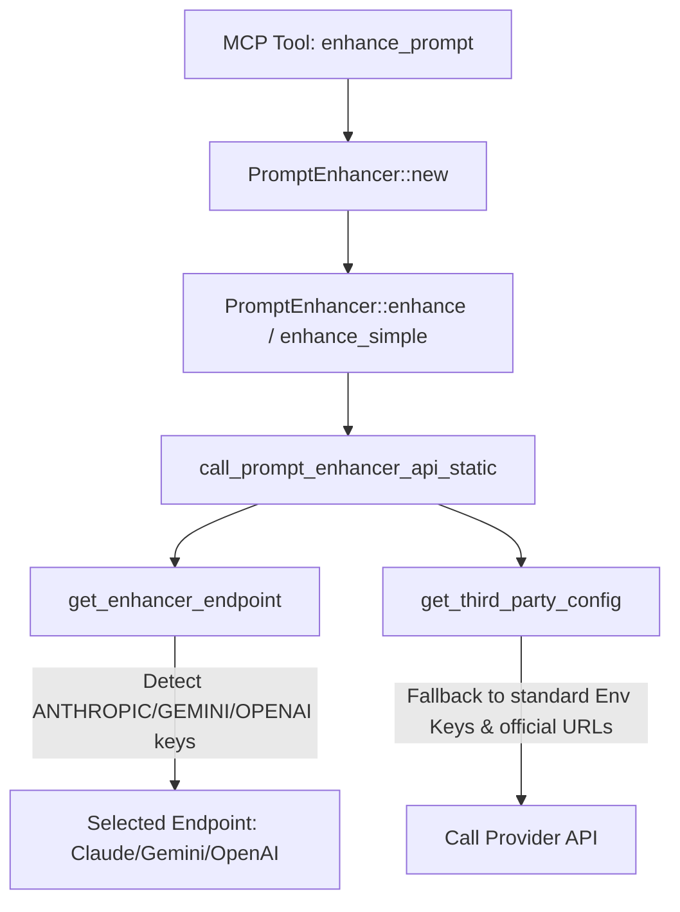

# Prompt Enhancer Redesign Plan: Smart Autodetection & Auto-Fallback

## 1. Background & Problem Statement

Currently, when the `enhance_prompt` MCP tool is invoked, it checks the `ACE_ENHANCER_ENDPOINT` environment variable. If it is not configured, it defaults to `local` mode.
In `local` mode, rather than calling any LLM API, the code simply renders the meta-prompt template (`ENHANCE_PROMPT_TEMPLATE` defined in `src/enhancer/templates.rs`) and returns it directly to the caller.

### The Core Bug / Design Flaw
The static template starts with:
```markdown
⚠️ NO TOOLS ALLOWED ⚠️

Here is an instruction that I'd like to give you, but it needs to be improved...
```
When this formatted string is returned to an LLM client (such as Claude Code or another CLI Agent), the client reads it as the *result* of the tool call and prints it to the user. It looks like a "Failed" execution or a cryptic "No Tools Allowed" error, creating a massive conceptual gap.

### The Objective
To dynamically align the prompt enhancement model and API with the calling agent's credentials. Since the client agent runs in the same shell session as the MCP server child process, standard environment variables (like `ANTHROPIC_API_KEY`, `GEMINI_API_KEY`, or `OPENAI_API_KEY`) are already loaded and inherited.
We will redesign the enhancer to **automatically inspect these inherited variables** and fallback to the corresponding provider with official API base URLs, achieving a **zero-configuration, adaptive "just works" experience**.

---

## 2. Technical Impact Analysis

### Affected Files
1. **`src/enhancer/prompt_enhancer.rs`**: Handles endpoint selection.
2. **`src/service/common.rs`**: Handles third-party service credential retrieval and default mappings.

### Relationship & Call Graph


### Risk Assessment: **LOW**
- **Backwards Compatibility**: Fully preserved. Dedicated `PROMPT_ENHANCER_*` variables will still take absolute priority.
- **Safety**: Purely read-only filesystem environment access and API call routing. No destructive operations or state mutations.

---

## 3. Implementation Details

### Step 1: Update `get_enhancer_endpoint()` in `src/enhancer/prompt_enhancer.rs`
Modify the fallback behavior when `ACE_ENHANCER_ENDPOINT` is missing:

```rust
pub fn get_enhancer_endpoint() -> EnhancerEndpoint {
    std::env::var(ENV_ENHANCER_ENDPOINT)
        .map(|v| EnhancerEndpoint::from_env_str(&v))
        .unwrap_or_else(|_| {
            // Automatically detect based on inherited standard API keys
            if std::env::var("ANTHROPIC_API_KEY").is_ok() {
                EnhancerEndpoint::Claude
            } else if std::env::var("GEMINI_API_KEY").is_ok() {
                EnhancerEndpoint::Gemini
            } else if std::env::var("OPENAI_API_KEY").is_ok() {
                EnhancerEndpoint::OpenAI
            } else {
                EnhancerEndpoint::Local
            }
        })
}
```

### Step 2: Update `get_third_party_config()` in `src/service/common.rs`
Update credential resolution to fallback gracefully to standard environment variables:

```rust
pub fn get_third_party_config(endpoint: EnhancerEndpoint) -> Result<ThirdPartyConfig> {
    // 1. Resolve Token / Key
    let token = if let Ok(t) = std::env::var(ENV_ENHANCER_TOKEN) {
        t
    } else {
        match endpoint {
            EnhancerEndpoint::Claude => std::env::var("ANTHROPIC_API_KEY").map_err(|_| {
                anyhow!(
                    "Neither {} nor ANTHROPIC_API_KEY environment variable is set for '{}' endpoint",
                    ENV_ENHANCER_TOKEN,
                    endpoint
                )
            })?,
            EnhancerEndpoint::Gemini => std::env::var("GEMINI_API_KEY").map_err(|_| {
                anyhow!(
                    "Neither {} nor GEMINI_API_KEY environment variable is set for '{}' endpoint",
                    ENV_ENHANCER_TOKEN,
                    endpoint
                )
            })?,
            EnhancerEndpoint::OpenAI => std::env::var("OPENAI_API_KEY").map_err(|_| {
                anyhow!(
                    "Neither {} nor OPENAI_API_KEY environment variable is set for '{}' endpoint",
                    ENV_ENHANCER_TOKEN,
                    endpoint
                )
            })?,
            _ => return Err(anyhow!("Unsupported endpoint for third-party config")),
        }
    };
    let token = token.trim().to_string();
    if token.is_empty() {
        return Err(anyhow!("API token/key is empty"));
    }

    // 2. Resolve Base URL
    let base_url = if let Ok(url) = std::env::var(ENV_ENHANCER_BASE_URL) {
        url
    } else {
        match endpoint {
            EnhancerEndpoint::Claude => {
                std::env::var("ANTHROPIC_BASE_URL").unwrap_or_else(|_| "https://api.anthropic.com".to_string())
            }
            EnhancerEndpoint::Gemini => {
                std::env::var("GEMINI_BASE_URL").unwrap_or_else(|_| "https://generativelanguage.googleapis.com".to_string())
            }
            EnhancerEndpoint::OpenAI => {
                std::env::var("OPENAI_BASE_URL").unwrap_or_else(|_| "https://api.openai.com".to_string())
            }
            _ => return Err(anyhow!("Unsupported endpoint for third-party config")),
        }
    };
    let base_url = base_url.trim().trim_end_matches('/').to_string();
    if base_url.is_empty() {
        return Err(anyhow!("API base URL is empty"));
    }

    // 3. Resolve Model
    let default_model = match endpoint {
        EnhancerEndpoint::Claude => DEFAULT_CLAUDE_MODEL,
        EnhancerEndpoint::OpenAI => DEFAULT_OPENAI_MODEL,
        EnhancerEndpoint::Gemini => DEFAULT_GEMINI_MODEL,
        _ => "claude-sonnet-4-5",
    };

    let model = match std::env::var(ENV_ENHANCER_MODEL) {
        Ok(value) => {
            let trimmed = value.trim();
            if trimmed.is_empty() {
                default_model.to_string()
            } else {
                trimmed.to_string()
            }
        }
        Err(_) => default_model.to_string(),
    };

    Ok(ThirdPartyConfig {
        base_url,
        token,
        model,
    })
}
```

---

## 4. Architectural Principles Compliance

- **KISS (Keep It Simple, Stupid)**: Avoids writing new custom config logic. We leverage the already existing, robust third-party API service files (`claude.rs`, `gemini.rs`, `openai.rs`) by simply modifying how they parse endpoints and configurations.
- **YAGNI (You Aren't Gonna Need It)**: Instead of creating a complex dynamic RPC bridging system between the client agent and the MCP server just to exchange API keys (which would be extremely over-engineered and require changing MCP client protocols), we dynamically read inherited shell environment variables.
- **DRY (Don't Repeat Yourself)**: Integrates directly into `get_third_party_config`, reusing all existing request structures and validation checks.
- **SOLID (Single Responsibility & Open/Closed)**: The `PromptEnhancer` and specific API services keep their single responsibilities intact. We are only opening the configuration parsing step to handle standard fallback variables.
